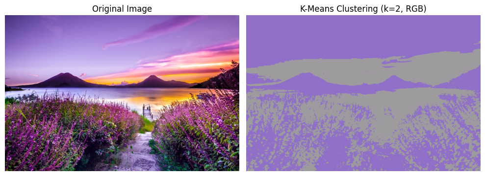
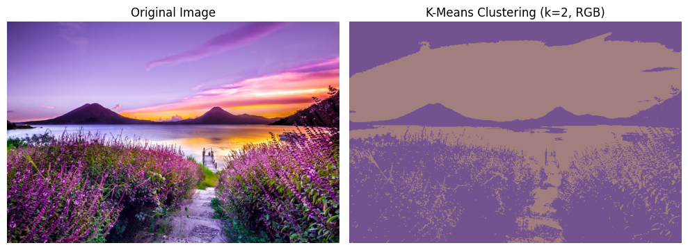
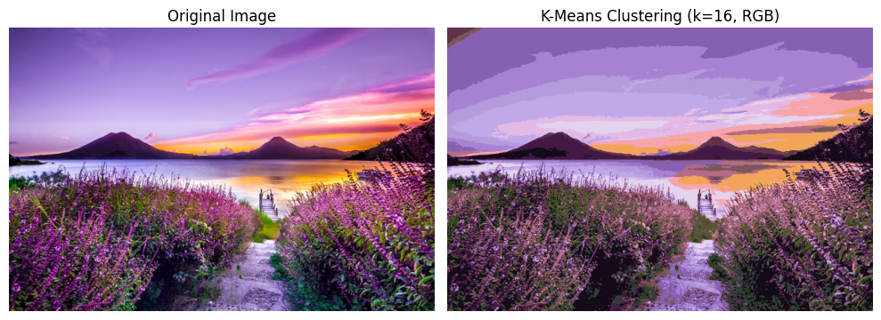
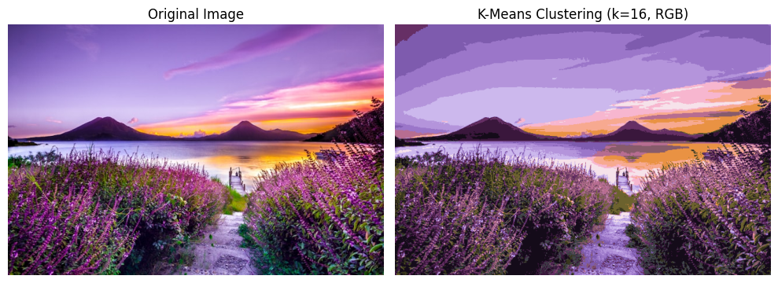
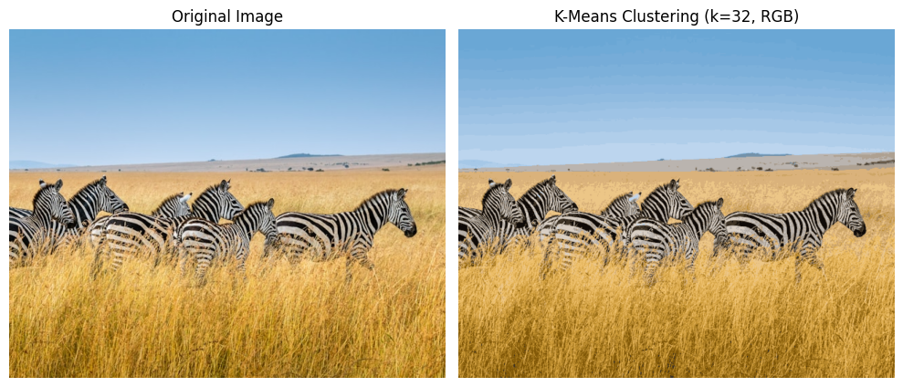

## K-means_clustering for colour-based image sorting.

### Project Overview, Image Clustering and Custom Colour Gradients:
This project uses k-means clustering in order to sort images by predominant colours. This project allows visualization to observe how the clustering of images changes over iterations. Additionally, this image contains a class that can generate custom colour gradients from pre-defined colours, or use preset colour gradients. These colour gradients can be used directly for creating interesting visuals in this project, displaying clear colour regions on images.

### Background & Motivation:
Clustering is a core technique in machine learning. The main purpose of this project is to sort images by colour, but it was a valuable learning experience, giving me the chance to develop a deeper understanding of the k-means algorithm. This implementation visually interesting results while also being fairly efficient, making it suitable for experimenting with colour clustering on images of different sizes. 

### Methodology:
The **"Colour_Map_Object"** class within **colour_maps.py** manages colour maps for visualization. It includes a set of predefined colours and gradients, and provides utilities for generating smooth gradients, extracting discrete palettes (including a HSV based palette) and plotting gradients. These tools can be used to visualize image clusters consistently and clearly. This code starts with the **"Image_To_Array"** class which converts images into pixel arrays across different colours space **(RGB, LAB, HSV, XYZ, LUV)**. It supports turning 3D image arrays into flattened arrays, allowing for easy data processing when using the clustering algorithm. It also provides basic tools to visualize the given image, and the image in different colour spaces (we would expect these to be identical or near identical). Using this class to generate an array in the flattened form can then be used for the k-means clustering. This is an iterative clustering method which groups pixels together based on their colours. This implementation works by randomly intializing k number of centroids, which represent the colour of a cluster. We then assign the pixels that are closest in RGB space to each cluster, and after we assign all pixels to the clusters, we calculate the new mean RGB value of a given cluster. Then repeat the assignment step for this new mean value, and recalculate mean, repeating until there is minimal change or max iterations are reached. Lastly this project includes the images sorter class which uses results from the k-means clustering in order to find images dominant colours. It allows loading multiple images from a folder which can then split the images into warm and cool colours, or sort the images along the colour spectrum.

### Results:

We can see some gradients below to see how exactly the colour gradients are generated and what they look like. We can see fairly nice images form, and the class allows for many sorts of gradients to be generated, including easily adding new colours into the dictionary of the class. 

### Below are just a few examples:

#### Custom gradient made from red and blue colours:
 

#### Premade gradient 'snw':
 

#### Premade gradient 'torq' :
 

First we tested to make sure the algorithm is correctly clustering colours by testing on a simple 2 colour checkerboard image. We would of course then expect that a value of k=2 would be sufficient for fully describing the image, but we need to consider the random initialization of centroids. If both centroids end up as either white or black, the image could end up starting as fully white, then the black squares would be an average of the white and black on the next iteration, then the last iteration will correctly show the checkerboard image. Of course, we can also randomly intialize directly into the correct image, but for more detailed images we will expect to require more iterations in order to reach a good approximation of the image.

### Below we can see this process in action:

#### Step 1:
 

#### Step 2:
 

#### Step 3:

We can see clearly that the clustering process works exactly as expected, so the new goal was to move on to more complicated images and observing the results. Additionally we can use the clustering process in different colour spaces, such as RGB or LAB and observe which colour space gives more desired results. Interestingly the LAB colour space is more closely related to how humans see, and so we would generally expect to see 'better' results from LAB colour space. The general observation I noticed throughout testing is that LAB did a better job of keeping colours, RGB could become more easily washed out, although this would require more formal testing. 

We also need to think about the k-value to use for different types of images, the k-value was quite obvious for the image above, since the entire image contained only 2 colours, but quickly gets more complicated to decide based on image properties. For example, if we look at pixel art images, we could easily count the number of unique colours and set k to that, but our main goal generally isn't to perfectly recreate the image, we are more generally trying to maintain enough detail to sort images. Picking k-values can be quite subjective (or you can use the elbow method, however for this project I did not recieve satisfactory results using this method). Generally for 32x32 pixel art images, 4-6 for a value of k would work, of course this is only a general idea, not a hard rule. For more detailed real world pictures, I normally found k values from 16-64 to be good at generalising the image, going up to k = 256 or higher would generally be enough to nearly perfectly recreate most images. Although the clustering always struggles to recreate smooth colour gradients as we would expect, it is easy to see how a single colour gradient could easily be split into hundreds of thousands of slightly different colours.

Below we can see testing of various k-values on a more realistic and colourful image. At low k-values the most interesting changes can be observed within the first few iterations, for example if one centroid ends up starting as a colour randomly (espcially if the colour isn't prominent in the image), the new iterations rapidly change colour to a closer representation of the average colour of the image.

### Results:

#### K = 2:

  
  
  
  
  

#### K = 4:

  
  
  
  

#### K = 8:

  
  
  
  

#### K = 16:

  
  
  

#### K = 32:

  

#### K = 64:

  

#### K = 128:

  

For the sake of not crowding with too many images, above are only some of the results at various iteration steps for a given k. I am displaying the images that show the most interesting changes/results, for the lower k-values, after the first few iterations there is very little change, and this generally becomes more true at all points of the process for higher k-values as we would expect. Interestingly we see here that even a value as low as k=8 does a relatively good job of capturing the primary colours of the image, and as k further increases the image becomes more closely recreated. This suggests that a value from anywhere between k=8 to k=16 is good enough for sorting even more detailed images, again this is subject to change dependent on the exact parameters of the image.

### Below are some gradient visualization images:

An interesting note is that this process does extremely well at recreating solid coloured objects, and the clusters are much more noticeable on gradient colours. This may sound obvious, but it is more interesting to see the how the results display this concept, for example in the images below, the zebras and the grass are almost perfectly recreated at k=32, however the sky of the image clearly has clustered colours. The bottom half of the image is nearly indistinguishable from the original at a glance, but the sky of the image is clearly split into distinct colour blocks.

Lastly we can see how this performs when it comes to sorting images by colour. I chose to use pixel-art images for this part due to simple colours and very quick k-means clustering of these low detail images. I used the following images to test both for warm-cool colour sorter, and colour spectrum based sorting. Note that the black backgrounds are ignored for the purposes of the algorithm and sorting. If not ignore these would severly ruin results, as up to half of some of these images would be considered black, which they are not.

  
  
  
  
  
  
  
  

### Cool-Warm Sorting Results:

#### Images considered 'cool':

#### Images considered 'warm':

### Colour Spectrum Sorting Results:

#### Images were sorted into this order:

#### Dominant colour of each image is considered to be:

### Future Improvements
Whilst this project is currently complete and fully functional, potential future enhancements include:
-Dynamic k-value selection
-Support for handling larger images, such as 4k resolution
-Intelligent image recolouring (this could be based on brightness relationships, or something else)

